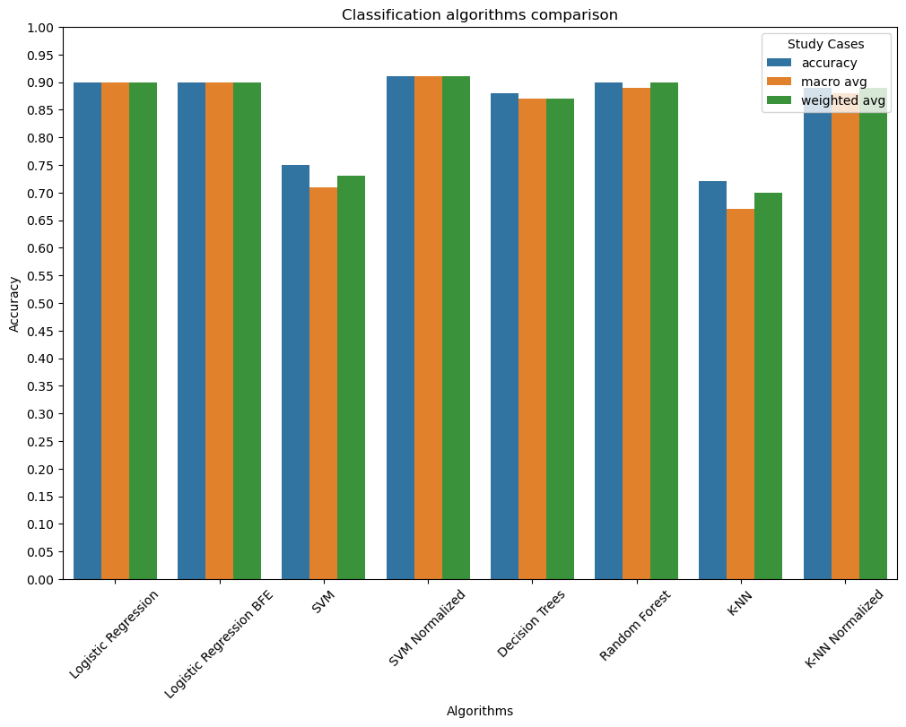

# Fundamentals of Data Analysis - Spambase
## Author: Rosario Scavo

This project was presented for the **Fundamentals of Data Analysis** course at the University of Catania for the academic year 2022/2023.
This repository contains a detailed analysis of the **Spambase Dataset** from the UCI Machine Learning Repository. The dataset can be downloaded from [here](http://archive.ics.uci.edu/dataset/94/spambase).


We evaluated a variety of classification algorithms, including **Logistic Regression**, **Logistic Regression with Backward Feature Elimination (BFE)**, **Support Vector Machine (SVM)**, **SVM with Normalized Data**, **Decision Trees**, **Random Forest**, **K-Nearest Neighbors (K-NN)**, and **K-NN with Normalized Data**. The performance of these algorithms was compared based on three metrics: accuracy, macro average, and weighted average.



Our findings suggest that, overall, the classification algorithms exhibited similar performance. Notably, **Logistic Regression**, both with and without **BFE**, **Random Forest**, and **Decision Trees** demonstrated robustness in accuracy and consistency across the metrics without the need for data normalization. However, it was observed that **SVM** and **K-NN** algorithms significantly benefited from data normalization. This improvement underscores the importance of preprocessing steps in data analysis, particularly when utilizing algorithms sensitive to the scale of the data, enhancing their ability to classify the data more effectively.

## Table of Contents

- Dataset description
  - Attribute description
- Dataset Analysis
  - Dataset integrity
  - Descriptive statistics
    - Histogram distributions
    - Word frequencies
    - Feature ratios
    - Hypothesis testing (chi-square test) on features
  - Outlier Analysis
    - Word frequencies
    - Character frequencies
    - Capital Run frequencies
    - Interquartile Range (IQR) Analysis
  - Multicollinearity
- Classification Algorithms
  - Logistic Regression
    - Multicollinearity in Logistic Regression
    - Reducing predictors
  - Support Vector Machine
    - Grid Search and Cross Validation
    - Impact of Data Normalization
  - Decision Tree
    - Grid Search and Cross Validation
    - Random Forest
  - K-Nearest Neighbors
    - Grid Search and Cross Validation
    - Impact of Data Normalization
- Conclusion

---
For detailed information, please refer to the `uci_spambase.ipynb` file or for simplicity, open the `uci_spambase.html` file.


## Installation

To set up the environment for this project, you have the option to use either `pip` or `Conda`.

### Using pip

To install the required packages with `pip`, simply run:

```bash
pip install -r requirements.txt
```

### Using Conda

You can also use `Conda` to create an environment with the necessary dependencies. To create the environment using the `requirements.txt` file, execute:

```bash
conda create --name <env_name> --file requirements.txt
```

### Creating an Environment from a .yaml File

Additionally, you can create a Conda environment directly from the `environment.yaml` file:

```bash
conda env create --name environment_name --file environment.yaml
```

Replace `<env_name>` and `environment_name` with your desired environment names. This will configure all necessary dependencies as specified in the configuration files.