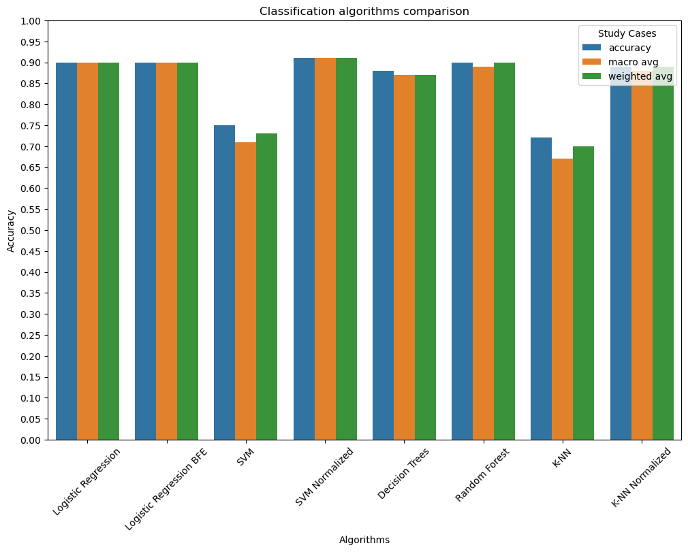

# UCI Spambase Classification Project
## Author: Rosario Scavo

End-to-end data analysis and classical machine learning project on the **UCI Spambase** dataset, focused on **EDA, feature analysis, preprocessing, model benchmarking, and evaluation** for spam classification.

**Live project page:** https://rosarioscavo.github.io/UCI-Spambase/

## Overview

This project analyzes the **Spambase** dataset from the UCI Machine Learning Repository and compares several classification approaches for email spam detection.

The work covers the full data science workflow:
- exploratory data analysis
- data integrity checks
- descriptive statistics
- feature-level analysis
- outlier detection
- multicollinearity assessment
- model selection and benchmarking
- hyperparameter tuning with cross-validation
- evaluation of preprocessing effects on model performance

## Dataset

- **Source:** UCI Machine Learning Repository
- **Dataset:** Spambase
- **Task:** Binary classification (`spam` vs `not spam`)

The dataset contains word-frequency, character-frequency, and capital-run-length features extracted from email messages.
It can be downloaded from [here](http://archive.ics.uci.edu/dataset/94/spambase).

## Methods

I benchmarked the following models:
- Logistic Regression
- Logistic Regression with backward feature elimination
- Support Vector Machine (SVM)
- Decision Tree
- Random Forest
- K-Nearest Neighbors (k-NN)

Model comparison included:
- train/test evaluation
- grid search
- cross-validation
- analysis of preprocessing and normalization effects

## Key Findings

- Most models achieved broadly comparable classification performance.
- **Logistic Regression, Decision Tree, and Random Forest** were competitive without requiring feature normalization.
- **SVM and k-NN** benefited noticeably from normalization, showing how preprocessing choices can materially affect performance.
- The project highlights the importance of combining **EDA, feature analysis, and evaluation discipline** rather than relying only on model choice.



## Table of Contents

- Dataset description
  - Attribute description
- Dataset Analysis
  - Dataset integrity
  - Descriptive statistics
    - Histogram distributions
    - Word frequencies
    - Feature ratios
    - Hypothesis testing (chi-square test) on features
  - Outlier Analysis
    - Word frequencies
    - Character frequencies
    - Capital Run frequencies
    - Interquartile Range (IQR) Analysis
  - Multicollinearity
- Classification Algorithms
  - Logistic Regression
    - Multicollinearity in Logistic Regression
    - Reducing predictors
  - Support Vector Machine
    - Grid Search and Cross Validation
    - Impact of Data Normalization
  - Decision Tree
    - Grid Search and Cross Validation
    - Random Forest
  - K-Nearest Neighbors
    - Grid Search and Cross Validation
    - Impact of Data Normalization
- Conclusion

## Installation

To set up the environment for this project, you have the option to use either `pip` or `Conda`.

### Using pip

To install the required packages with `pip`, simply run:

```bash
pip install -r requirements.txt
```

### Using Conda

You can also use `Conda` to create an environment with the necessary dependencies. To create the environment using the `requirements.txt` file, execute:

```bash
conda create --name <env_name> --file requirements.txt
```

### Creating an Environment from a .yaml File

Additionally, you can create a Conda environment directly from the `environment.yaml` file:

```bash
conda env create --name environment_name --file environment.yaml
```

Replace `<env_name>` and `environment_name` with your desired environment names. This will configure all necessary dependencies as specified in the configuration files.